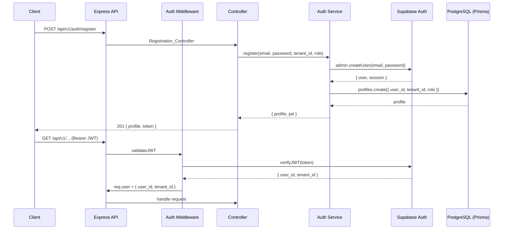

# Design Document: user-auth

## Overview

This document describes the technical design for user authentication in ClinicCore 2.0. The feature covers email/password registration and login, Google OAuth sign-in/sign-up, role selection during registration, JWT validation on protected endpoints, and strict multi-tenancy enforcement.

All identity management is delegated to Supabase Auth. The backend never stores passwords — it only stores a profile record in PostgreSQL (via Prisma) that links the Supabase user ID to a `tenant_id` and `role`. Every protected endpoint validates the Supabase-issued JWT before any business logic runs.

### Key Design Decisions

- **Supabase Auth as the identity provider**: Supabase handles password hashing, JWT issuance, OAuth flows, and token refresh. The backend trusts Supabase JWTs and validates them using the `SUPABASE_JWT_SECRET` (the `JWT_SECRET` env var).
- **Profile record separate from Supabase identity**: Supabase stores the auth identity; PostgreSQL stores the application profile (`user_id`, `tenant_id`, `role`, timestamps). This keeps auth concerns separate from domain data.
- **Service-role client for admin operations**: Registration and OAuth provisioning use the Supabase service-role key to create users server-side, avoiding client-side signup flows that could be abused.
- **Tenant scoping at the service layer**: Every Prisma query in `Auth_Service` includes a `tenant_id` filter. The middleware extracts `tenant_id` from the JWT and attaches it to `req` so downstream services never need to trust user-supplied tenant values.

---

## Architecture



### Component Layout

```
backend/src/
├── middleware/
│   └── auth.js              # JWT validation, attaches req.user
├── controllers/
│   ├── auth.register.js     # Registration_Controller
│   ├── auth.login.js        # Login_Controller
│   └── auth.oauth.js        # OAuth_Controller
├── services/
│   └── auth.service.js      # Auth_Service — orchestrates Supabase + Prisma
├── models/
│   └── profile.model.js     # Profile_Store — Prisma queries, always tenant-scoped
├── routes/
│   └── auth.js              # Mounts all /api/v1/auth routes
└── config/
    └── supabase.js          # Supabase client instances (anon + service-role)
```

---

## Components and Interfaces

### `config/supabase.js`

Exports two Supabase clients:

```js
// anon client — used for OAuth redirects
export const supabaseAnon = createClient(SUPABASE_URL, SUPABASE_ANON_KEY);

// service-role client — used for server-side user creation and JWT verification
export const supabaseAdmin = createClient(SUPABASE_URL, SUPABASE_SERVICE_ROLE_KEY);
```

### `middleware/auth.js` — Auth_Middleware

Validates the Bearer JWT on every protected route.

```js
// Signature
export async function requireAuth(req, res, next)
```

- Reads `Authorization: Bearer <token>` header
- Calls `supabaseAdmin.auth.getUser(token)` to verify and decode
- On success: attaches `req.user = { user_id, tenant_id, role }` and calls `next()`
- On failure: returns `401 { error: 'unauthorized', message: '...' }`
- Tenant mismatch (if a resource's `tenant_id` differs from `req.user.tenant_id`): returns `403`

### `services/auth.service.js` — Auth_Service

Orchestrates Supabase Auth calls and Prisma profile operations.

```js
register(email, password, tenantId, role) → { profile, token }
login(email, password)                    → { profile, token }
getOrCreateOAuthProfile(supabaseUser, tenantId, role) → { profile, token, isNew }
getProfileByUserId(userId, tenantId)      → profile
```

All methods that touch the DB pass `tenant_id` to `Profile_Store` — never omitted.

### `models/profile.model.js` — Profile_Store

Thin Prisma wrapper. Every query is tenant-scoped.

```js
createProfile({ userId, tenantId, role })         → profile
findByUserId(userId, tenantId)                     → profile | null
findByEmail(email, tenantId)                       → profile | null
```

### `controllers/auth.register.js` — Registration_Controller

```
POST /api/v1/auth/register
Body: { email, password, tenant_id, role }
→ 201 { profile, token }
→ 400 (validation failure)
→ 409 (email already exists)
```

### `controllers/auth.login.js` — Login_Controller

```
POST /api/v1/auth/login
Body: { email, password }
→ 200 { profile, token }
→ 400 (missing fields)
→ 401 (invalid credentials)
```

### `controllers/auth.oauth.js` — OAuth_Controller

```
GET  /api/v1/auth/oauth/google          → redirect to Supabase Google OAuth URL
GET  /api/v1/auth/oauth/callback        → exchange code, provision profile
     Query: { code, tenant_id?, role? }
→ 200 { profile, token }          (existing user)
→ 201 { profile, token }          (new user provisioned)
→ 400 (OAuth error / missing tenant+role for new user)
```

### `routes/auth.js`

```js
router.post('/register', Registration_Controller)
router.post('/login',    Login_Controller)
router.get('/oauth/google',   OAuth_Controller.redirect)
router.get('/oauth/callback', OAuth_Controller.callback)
```

---

## Data Models

### Prisma Schema — `profiles` table

```prisma
model Profile {
  id         String   @id @default(uuid())
  userId     String   @unique @map("user_id")   // Supabase Auth user ID
  tenantId   String   @map("tenant_id")          // non-nullable FK to tenants
  role       Role
  email      String
  createdAt  DateTime @default(now()) @map("created_at")
  updatedAt  DateTime @updatedAt      @map("updated_at")

  @@index([tenantId])
  @@map("profiles")
}

enum Role {
  admin
  doctor
  nurse
  receptionist
  lab_technician
  pharmacist
  secretary
}
```

### API Response Shape — Profile (no password ever returned)

```json
{
  "id": "uuid",
  "userId": "supabase-user-uuid",
  "tenantId": "tenant-uuid",
  "role": "doctor",
  "email": "user@clinic.com",
  "createdAt": "2024-01-01T00:00:00.000Z"
}
```

### JWT Claims (Supabase-issued)

Supabase embeds custom claims in the JWT. The backend reads:

```json
{
  "sub": "<supabase user_id>",
  "app_metadata": {
    "tenant_id": "<tenant_id>",
    "role": "<role>"
  }
}
```

`tenant_id` and `role` are written to `app_metadata` during registration/OAuth provisioning via the service-role client (`supabaseAdmin.auth.admin.updateUserById`).

